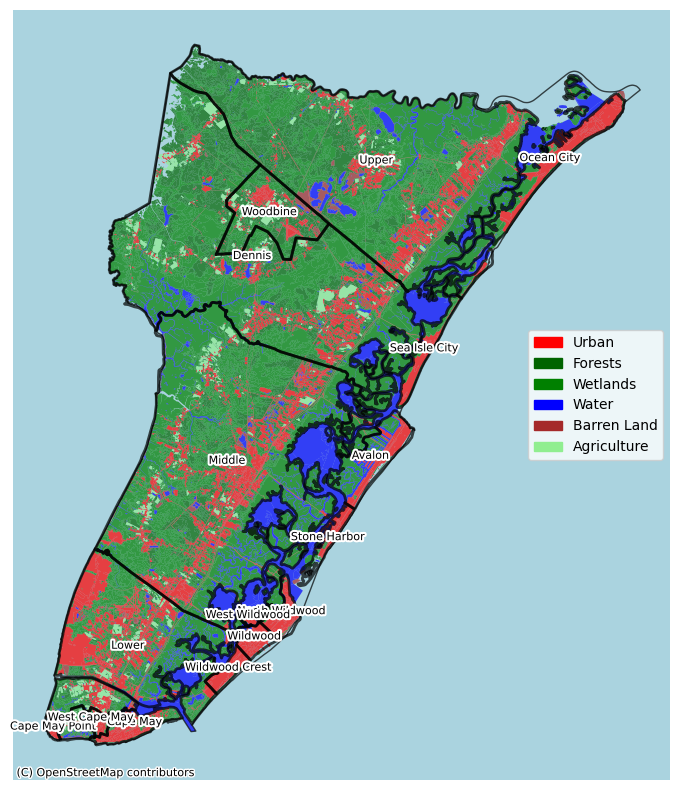
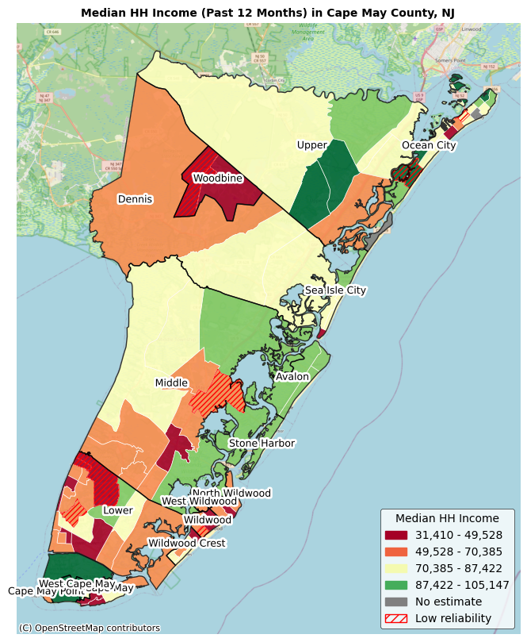
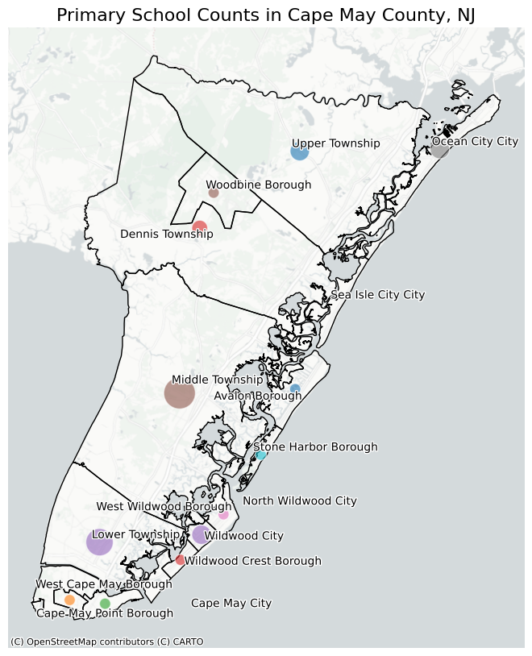
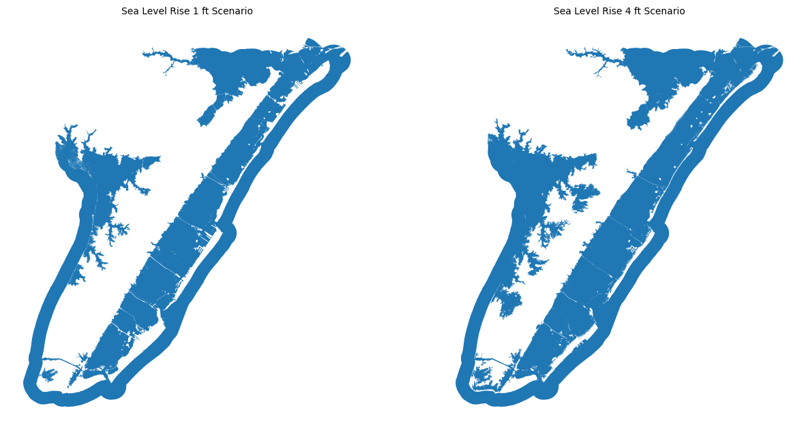

# Sea Level Rise and Environmental Burdens in Cape May County,  New Jersey
**Name:** Vivek Dsouza  
**Course:** Command-Line GIS (Fall 2024)  
**Instructor:** Prof. Will Payne  
**School:** Edward. J. Bloustein School of Planning and Public Policy, Rutgers University - New Brunswick.

## Cape May County, New Jersey
Cape May County is the southernmost county in the U.S. state of New Jersey. Much of the county is located on the Cape May peninsula, bound by the Delaware Bay to its west and the Atlantic Ocean to its south and east.
Sea level rise poses a threat to people and property in coastal areas around the world and is especially acute in [New Jersey.](https://njclimateresourcecenter.rutgers.edu/climate_change_101/sea-level-rise-in-new-jersey-projections-and-impacts/)
This makes Cape May County inhabitants equally vuleranle to sea level rise.
In Cape May, sea level rose 11 inches from 1970 to present. Under the Intermediate Scenario, sea level is expected to rise 12 inches from [2020 to 2050](https://sealevel.globalchange.gov/national-sea-level-explorer/?psmsl_id=1153&scope=section_1#:~:text=In%20Cape%20May%2C%20sea%20level,inches%20from%201970%20to%20present.)
In addition, residents of Cape May are also exposed to other environmental burdens such as exposure to contaminated sites.
Exposure to hazardous materials as well as the threat of rising sea levels puts residents at severe risk.

**Research Questions:** To understand the level of exposure of known Contaminated Sites and to visualize the extent of sea level rise over essential infrastructure like Public Schools and Food Pantries in Cape May County, New Jersey.

## Datasets used and Process
1. **Land Use and Land Cover Data** (Source: NJGIN Open Data)
   - Clipped NJ's LULC master dataset to Cape May County
3. **Socio-demographic data:** Social Security Income in the past 12 months, Total Housing Units, Median Household Income in the past 12 months (Source: ACS 2019)
4. **Sea Level Rise 1ft and 4ft projection data** (Source: NOAA Sea Level Rise Viewer)
    - Created a 1-mile buffer around Cape May County boundary
    - Clipped SLR scenarios using buffer boundary
    - Combined multiple polygon attributes to 1 polygon using union.
6. **List of Food Pantries in Cape May County**
    - Created a CSV of food pantries and geocoded locations
8. **Known Contaminated Sites** (Source: NJGIN Open Data)
   - Used the 1-mile buffer of Cape May County boundary and clipped data to include sites within and outside (in close proximity) of Cape May
10. **LIHTC Building locations** (Source: HUD, Policymap)
    - Downloaded point data only within Cape May
    - Geocoded LIHTC locations
    - Conducted polygon to point spatial join
12. **Public School locations** (Source: National Center for Education Statistics, Policymap)
    - Downloaded point data only within Cape May
    - Geocoded primary school locations
    - Conducted point to polygon spatial join.

## Land Use Cover in Cape May County

## Two Static Maps

**Relevant US ACS Variable**

**Spatial Join / Geoprocessing tool**

## Sea Level Rise 1 and ft Scenarios

## Interactive Map
Interactive map showing public schools and public housing pverlayed with contaminated buffers and sea level rise scenarios to illustrate a) exposure to hazardous material and b) threats to life and property due to climate change.
<iframe src="Final_Final_Maps.html" height="500" width="800"></iframe>

You can explore this map [as its own web page here](Final_Final_Maps.html).
